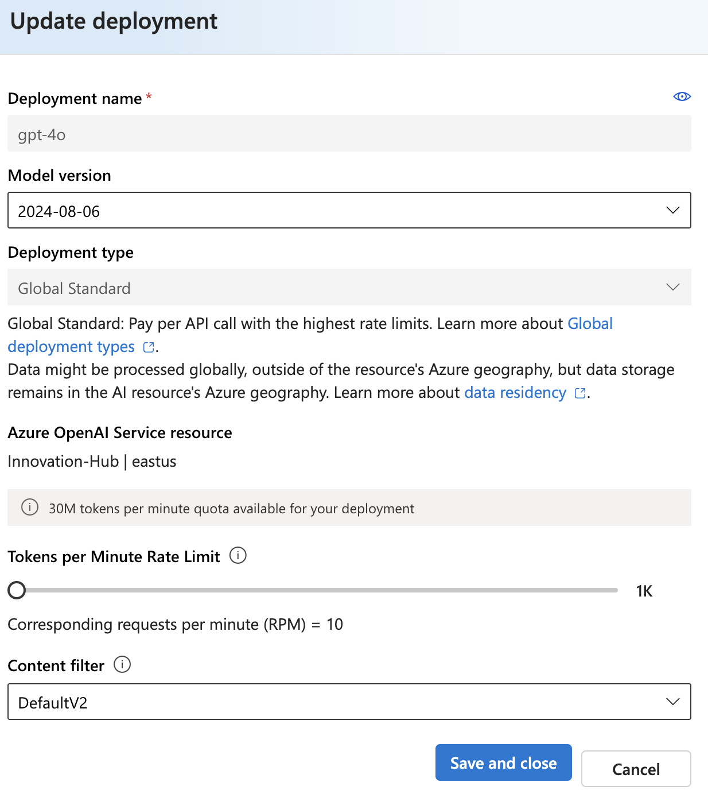

# Implementing Load Balancing Logic in a Flask Chatbot


In this post, we will dive deep into the load balancing logic implemented in a Flask-based chatbot that utilizes Azure OpenAI's models. Load balancing is crucial for ensuring that our application can handle varying loads effectively and maintain high availability by seamlessly switching between different models based on their performance and availability.  
   
## Understanding Load Balancing in Chatbots  
   
Load balancing in the context of a chatbot refers to the strategy of distributing user requests across multiple models or instances. This approach helps:  
   
1. **Avoid Rate Limits**: Different models may have different rate limits and capabilities. By distributing requests among them, we can minimize the chances of hitting these limits.  
     
2. **Enhance Availability**: If one model is experiencing issues or is unavailable, the system can automatically switch to another model, ensuring that the chatbot remains operational.  
   
3. **Optimize Performance**: Different models may perform better for specific queries. Load balancing allows us to utilize the strengths of each model effectively.  



## The Flask Application with Load Balancing Logic  
   
Let's look at the implementation of a Flask application that incorporates load balancing between Azure OpenAI models. Below is the complete code with detailed explanations of the load balancing logic.  
   
### Code Implementation  
   
```python  
from flask import Flask, jsonify, request  
import os  
from openai import AzureOpenAI  
from dotenv import load_dotenv  
   
# Load the .env file  
load_dotenv()  
   
app = Flask(__name__)  
   
AZURE_OPENAI_ENDPOINT = os.environ.get("AZURE_OPENAI_ENDPOINT")  
AZURE_OPENAI_API_KEY = os.environ.get("AZURE_OPENAI_API_KEY")  
client = AzureOpenAI(azure_endpoint=AZURE_OPENAI_ENDPOINT, api_version="2023-07-01-preview", api_key=AZURE_OPENAI_API_KEY)  
   
def create_chat_completion(client, user_query, sample_context, model="gpt-4o"):  
    try:  
        return client.chat.completions.create(  
            messages=[  
                {"role": "user", "content": user_query},  
                {"role": "system", "content": sample_context}  
            ],  
            model=model,  
        )  
    except Exception as e:  
        error_message = str(e)  
        print(f"Error with model {model}: {error_message}")  
        return None  
   
@app.route('/', methods=['GET'])  
def chat():  
    # Get the user query  
    user_query = request.args.get('query', default='testing', type=str)  
  
    # Sample context for the chatbot  
    SAMPLE_CONTEXT = "You are a helpful assistant."  
  
    # Load balancing logic  
    models = ["gpt-4o", "gpt-35-turbo"]  
    for model in models:  
        chat_completion = create_chat_completion(client, user_query, SAMPLE_CONTEXT, model=model)  
        if chat_completion:  
            return jsonify({"chat_completion": chat_completion.choices[0].message.content})  
  
    return jsonify({"error": "All models are currently unavailable."}), 503  
   
if __name__ == '__main__':  
    app.run(host='0.0.0.0', port=1020)  
```  
   
### Breakdown of Load Balancing Logic  
   
1. **Model List Definition**:   
   ```python  
   models = ["gpt-4o", "gpt-35-turbo"]  
   ```  
   Here, we define a list of models that our chatbot will use. This list can be easily extended to include additional models as needed.  
   
2. **Sequential Model Invocation**:  
   ```python  
   for model in models:  
       chat_completion = create_chat_completion(client, user_query, SAMPLE_CONTEXT, model=model)  
       if chat_completion:  
           return jsonify({"chat_completion": chat_completion.choices[0].message.content})  
   ```  
   The core of our load balancing logic lies in this loop. For each request, we attempt to generate a response using each model in the order they

## OUTPUT

```
127.0.0.1 - - [22/Jan/2025 01:18:22] "GET /?query=testing HTTP/1.1" 200 -
127.0.0.1 - - [22/Jan/2025 01:18:22] "GET /?query=testing HTTP/1.1" 200 -
Error with model gpt-4o: Error code: 429 - {'error': {'code': '429', 'message': 'Requests to the ChatCompletions_Create Operation under Azure OpenAI API version 2023-07-01-preview have exceeded token rate limit of your current OpenAI S0 pricing tier. Please retry after 7 seconds. Please go here: https://aka.ms/oai/quotaincrease if you would like to further increase the default rate limit.'}}
Switching to gpt-35-turbo...
Error with model gpt-4o: Error code: 429 - {'error': {'code': '429', 'message': 'Requests to the ChatCompletions_Create Operation under Azure OpenAI API version 2023-07-01-preview have exceeded token rate limit of your current OpenAI S0 pricing tier. Please retry after 7 seconds. Please go here: https://aka.ms/oai/quotaincrease if you would like to further increase the default rate limit.'}}
Switching to gpt-35-turbo...
127.0.0.1 - - [22/Jan/2025 01:19:01] "GET /?query=testing HTTP/1.1" 200 -
127.0.0.1 - - [22/Jan/2025 01:19:01] "GET /?query=testing HTTP/1.1" 200 -
127.0.0.1 - - [22/Jan/2025 01:19:01] "GET /?query=testing HTTP/1.1" 200 -
127.0.0.1 - - [22/Jan/2025 01:19:01] "GET /?query=testing HTTP/1.1" 200 -

```
